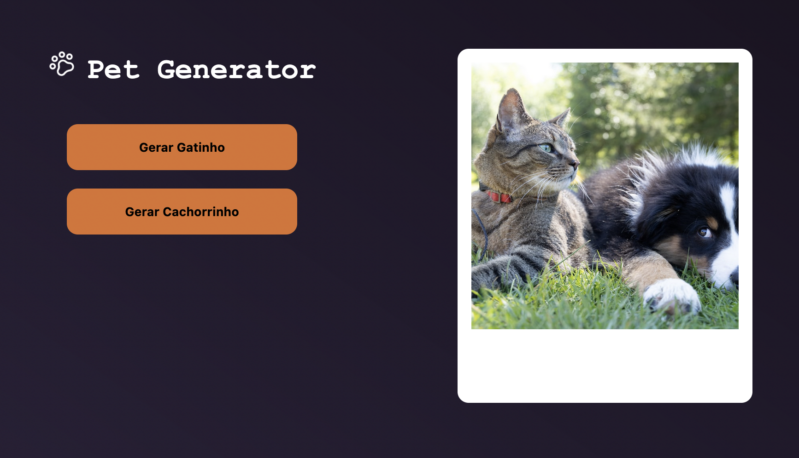
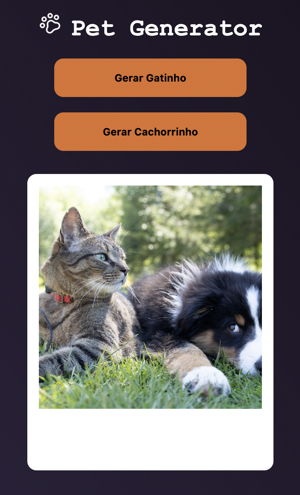

## Tech Pro Bem - Teste Front-End

<details>
<summary><b>Tecnologias</b></summary>

- React
- TypeScript
- CSS in JS (Styled Components)
- Axios

</details>

<details>
<summary><b>APIs utilizadas</b></summary>

- https://place.dog/300/200

- http://placekitten.com/200/300

</details>

<details>
<summary><b>Como rodar em sua máquina</b></summary>

Clone o repositório:
```
git clone git@github.com:aferanda/teste-frontend.git
```
Navegue até o diretório criado:
```
cd teste-frontend
```
Instale as dependências:
```
npm install
```
ou
```
yarn
```
Agora é só rodar a aplicação:
```
npm run start
```
ou
```
yarn start
```
</details>

### Layout:



